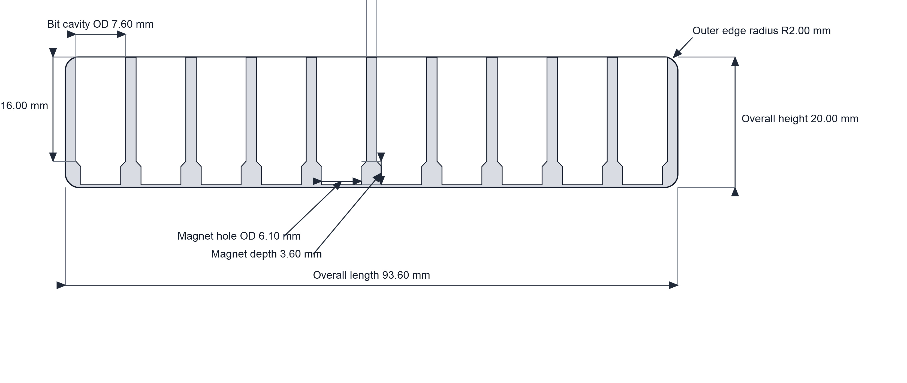
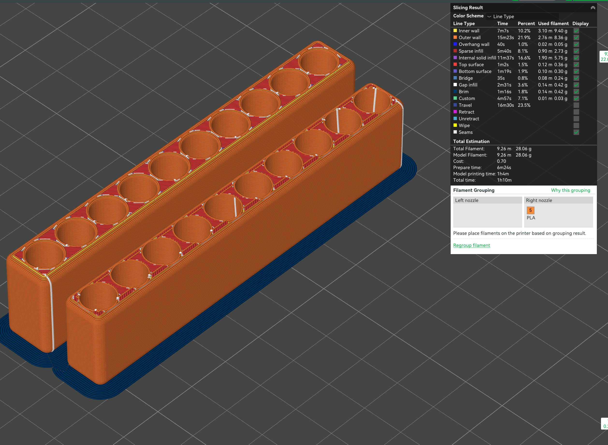

# Magnetic Bit Holder (build123d)

Parametric linear 1/4 in bit holder generator.

Designed for `6x3 mm` neodymium magnets: each cavity includes a magnet pocket and entry bevel so magnets can be press-fit after printing, using a 1/4 in bit (or similar blunt tool) to push each magnet to final depth.

## Quick Use

1. Edit values in `BitHolderParams` inside `linear_bit_holder.py`.
2. Run:
   - `python linear_bit_holder.py`
3. Generated outputs:
   - `linear_bit_holder_10bit.stl`
   - `linear_bit_holder_10bit.step`
   - `linear_bit_holder_10bit_cutaway.svg`
   - `linear_bit_holder_10bit_cutaway.jpg`

## Default Parameters

- `bit_count`: `10`
- `bit_cavity_diameter`: `7.6`
- `bit_cavity_depth`: `16.0`
- `magnet_pocket_diameter`: `6.1`
- `magnet_pocket_depth`: `3.6`
- `magnet_bevel_depth`: `0.8`
- `spacing_between_hole_ods`: `1.6`
- `side_wall_thickness`: `1.6`
- `end_wall_thickness`: `1.6`
- `outer_edge_radius`: `2.0`
- `bit_entry_bevel`: `0.0`

## 2D Cutaway

## Slicer Preview

